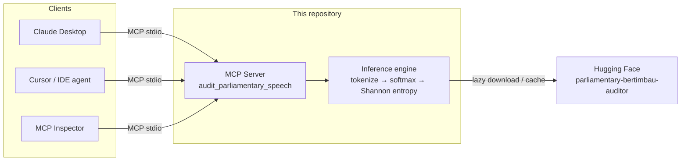
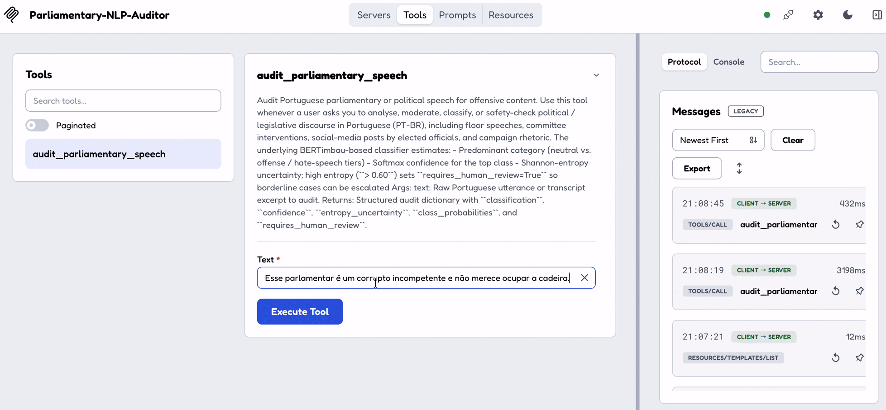

# Parliamentary NLP MCP Auditor

[](https://www.python.org/downloads/)
[](https://modelcontextprotocol.io/)
[](https://huggingface.co/docs/transformers)
[](https://huggingface.co/alissonf216/parliamentary-bertimbau-auditor)
[](LICENSE)
[](docker-compose.yml)

A **Model Context Protocol (MCP)** server providing structured tools for auditing hate speech and offensive language in formal Brazilian parliamentary speeches.

Built for institutional speech moderation in a **low-resource NLP** setting (Brazilian Portuguese): a BERTimbau-family classifier with explicit **uncertainty quantification** and a stable tool contract for LLM clients (Cursor, Claude Desktop, MCP Inspector).

---
---
---

## Table of Contents

1. [Summary](#summary)
2. [Architecture](#architecture)
3. [Demo](#demo)
4. [Key Features](#key-features)
5. [Quickstart via Docker](#quickstart-via-docker)
6. [Installation Tutorial](#installation-tutorial)
7. [Usage Tutorial](#usage-tutorial)
8. [Connect to Cursor / Claude Desktop](#connect-to-cursor--claude-desktop)
9. [Sample Output](#sample-output)
10. [Project Layout](#project-layout)
11. [Inference Pipeline](#inference-pipeline)
12. [Troubleshooting](#troubleshooting)
13. [License](#license)

---

## Summary

Legislative chambers produce a continuous stream of floor speeches and digital rhetoric. Offensive language, ad-hominem attacks, and hate speech in that stream are costly to review manually and poorly covered by English-centric moderation stacks.

This repository is the **serving layer** of a parliamentary discourse auditor:

| Layer | What it does |
| --- | --- |
| **MCP tool** | Exposes `audit_parliamentary_speech(text)` over stdio for assistants and IDE agents |
| **Inference engine** | Tokenize → BERTimbau-family forward pass → softmax → Shannon entropy → structured JSON |
| **Human-in-the-loop** | `requires_human_review=true` when entropy \(> 0.60\) (ambiguous predictions) |

**Modeling (corpus, taxonomy, training, metrics, results, figures)** lives in a dedicated document:

👉 **[docs/MODELING.md](docs/MODELING.md)** — full modeling & evaluation specification

Reproducible experiments (notebook + pipeline) and raw tables:

- **[notebooks/](notebooks/)** — `experiments_hierarchy_imbalance.ipynb` + `experimentos_pipeline.py`
- **[docs/results/](docs/results/)** — CSV / JSON metrics
- **[docs/figures/](docs/figures/)** — heatmaps, confusion matrices, ROC/PR

### Runtime model strategy (important)

| Stage | Checkpoint | Purpose |
| --- | --- | --- |
| **Default** | [`alissonf216/parliamentary-bertimbau-auditor`](https://huggingface.co/alissonf216/parliamentary-bertimbau-auditor) | Fine-tuned parliamentary BERTimbau (4-class taxonomy) — see [docs/MODELING.md](docs/MODELING.md) |

Override without code changes:

```bash
export PARLIAMENTARY_NLP_MODEL_ID="alissonf216/parliamentary-bertimbau-auditor"
parliamentary-nlp-mcp
```

Canonical labels: `NEUTRAL`, `GENERIC_OFFENSE`, `TARGETED_OFFENSE`, `EXPLICIT_HATE_SPEECH`.

---

## Architecture

The server is a thin MCP façade over a fine-tuned transformer. Agents talk MCP over **stdio**; weights load lazily from Hugging Face on the first tool call.



---

## Demo

Screen capture of the tool classifying a parliamentary utterance via an MCP client
(Claude Desktop, Cursor, or MCP Inspector):

<!-- After recording, save as docs/demo/mcp-audit-demo.gif and uncomment:

-->

> **Add your demo:** record a short GIF/video of `audit_parliamentary_speech` returning
> `classification`, `confidence`, and `requires_human_review`, then place it at
> [`docs/demo/mcp-audit-demo.gif`](docs/demo/) (see [`docs/demo/README.md`](docs/demo/README.md)).

Until a recording is available, use the [Sample Output](#sample-output) JSON and the
[MCP Inspector walkthrough](#option-c--interactive-demo-with-mcp-inspector) below.

---

## Key Features

| Feature | Detail |
| --- | --- |
| **MCP / FastMCP integration** | Single tool `audit_parliamentary_speech` over stdio (SDK 1.x `FastMCP` or 2.x `MCPServer`), ready for Cursor / Claude Desktop / MCP Inspector |
| **Portuguese BERT backbone** | Default: [`alissonf216/parliamentary-bertimbau-auditor`](https://huggingface.co/alissonf216/parliamentary-bertimbau-auditor); override via `PARLIAMENTARY_NLP_MODEL_ID` |
| **Research taxonomy** | Canonical labels: `NEUTRAL`, `GENERIC_OFFENSE`, `TARGETED_OFFENSE`, `EXPLICIT_HATE_SPEECH` (see [MODELING.md](docs/MODELING.md)) |
| **Uncertainty quantification** | Softmax probabilities + Shannon entropy \(H(X)=-\sum P(x)\log P(x)\); `requires_human_review=true` when entropy \(> 0.60\) |
| **Lazy singleton load** | Model weights download on first tool call, not at import time |
| **Documented evaluation** | Stratified CV, imbalance strategies, Flat / binary / cascade — [MODELING.md](docs/MODELING.md) + [notebooks/](notebooks/) + [figures](docs/figures/) |
| **Docker image** | Reproducible runtime via `Dockerfile` + `docker compose` (HF cache volume) |

---

## Quickstart via Docker

Requires [Docker](https://docs.docker.com/get-docker/) with Compose v2.

### 1 — Build and start the MCP server

```bash
git clone https://github.com/alissonf216/parliamentary-nlp-mcp.git
cd parliamentary-nlp-mcp
docker compose up --build
```

The container entrypoint is `parliamentary-nlp-mcp` (MCP over **stdio**). It will look idle in the terminal until a client attaches — that is expected. Model weights download on the first tool call and persist in the `hf-cache` volume.

Optional overrides (create a local `.env` or export before `compose up`):

```bash
export PARLIAMENTARY_NLP_MODEL_ID=alissonf216/parliamentary-bertimbau-auditor
# export HF_TOKEN=hf_...   # only if the checkpoint is private
docker compose up --build
```

### 2 — Point an MCP client at the container

**One-shot interactive run** (recommended for Claude Desktop / Cursor):

```json
{
  "mcpServers": {
    "parliamentary-nlp": {
      "command": "docker",
      "args": [
        "compose",
        "-f",
        "/absolute/path/to/parliamentary-nlp-mcp/docker-compose.yml",
        "run",
        "--rm",
        "-i",
        "parliamentary-nlp-mcp"
      ]
    }
  }
}
```

**Or** a direct image run after `docker compose build`:

```bash
docker compose run --rm -i parliamentary-nlp-mcp
```

> Prefer a local venv instead? Skip to [Installation Tutorial](#installation-tutorial).

---

## Installation Tutorial

Follow these steps from a clean machine. Commands assume macOS / Linux; Windows notes are included inline.

### Step 0 — Prerequisites

| Requirement | Why |
| --- | --- |
| **Python 3.10+** | Runtime for the package (`python3 --version`) |
| **pip / venv** | Dependency isolation |
| **~500 MB free disk** | First download of the Hugging Face checkpoint |
| **Node.js 18+** *(optional)* | Only needed for the MCP Inspector (`npx`) |

Check your Python version:

```bash
python3 --version
# Expected: Python 3.10.x or newer
```

> If `python3` points to 3.9 or older, install a newer interpreter (Homebrew, pyenv, Conda, etc.) and use that binary in the steps below.

### Step 1 — Clone the repository

```bash
git clone https://github.com/alissonf216/parliamentary-nlp-mcp.git
cd parliamentary-nlp-mcp
```

Or, if you already have the folder locally:

```bash
cd /path/to/parliamentary-nlp-mcp
```

### Step 2 — Create and activate a virtual environment

```bash
python3 -m venv .venv

# macOS / Linux
source .venv/bin/activate

# Windows (PowerShell)
# .venv\Scripts\Activate.ps1
```

You should see `(.venv)` in your shell prompt.

### Step 3 — Install the package (editable + dev tools)

```bash
pip install -U pip setuptools wheel
pip install -e ".[dev]"
```

What this does:

- installs `mcp`, `torch`, `transformers`, and project code in editable mode
- adds `pytest` for the test suite
- registers the console command `parliamentary-nlp-mcp`

Verify the install:

```bash
which parliamentary-nlp-mcp
python -c "import parliamentary_nlp; print(parliamentary_nlp.__version__)"
```

### Step 4 — Run the unit tests (recommended)

Tests **mock** Hugging Face — no GPU and no model download:

```bash
pytest -v
```

Expected: all tests pass (e.g. `5 passed`).

---

## Usage Tutorial

There are three ways to use the auditor: **Python API**, **MCP server + Inspector**, or **IDE / Claude Desktop**.

### Option A — Call the model from Python

Useful for notebooks, scripts, and debugging the prediction schema.

```python
from parliamentary_nlp import ParliamentaryModel

# First run downloads and caches the default Hugging Face model
model = ParliamentaryModel()

result = model.predict(
    "Esse parlamentar é um corrupto incompetente e não merece ocupar a cadeira."
)
print(result)
```

Use your own fine-tuned checkpoint:

```python
model = ParliamentaryModel(
    model_id="alissonf216/parliamentary-bertimbau-auditor"
)
print(model.predict("Senhor presidente, peço a palavra."))
```

Or via environment variable (also works for the MCP server):

```bash
export PARLIAMENTARY_NLP_MODEL_ID="alissonf216/parliamentary-bertimbau-auditor"
```

### Option B — Run the MCP server locally

With the venv active:

```bash
parliamentary-nlp-mcp
```

Equivalents:

```bash
python -m parliamentary_nlp
python -m parliamentary_nlp.server
```

The process speaks **MCP over stdio** (it will look “idle” in the terminal — that is normal). Stop it with `Ctrl+C`.

### Option C — Interactive demo with MCP Inspector

Best way to try the tool without wiring an IDE yet.

1. Keep the venv **activated** (so `parliamentary-nlp-mcp` is on `PATH`).
2. In the same project directory, run:

```bash
npx @modelcontextprotocol/inspector parliamentary-nlp-mcp
```

3. The Inspector opens in the browser.
4. Connect to the server, then select the tool **`audit_parliamentary_speech`**.
5. Pass a Portuguese string in the `text` argument, for example:

```text
O debate deve ser respeitoso e baseado em evidências.
```

6. Click **Run**. The first call may take a minute while the model downloads; later calls are faster.

If `npx` cannot find the command, pass the absolute path to the binary:

```bash
npx @modelcontextprotocol/inspector /absolute/path/to/parliamentary-nlp-mcp/.venv/bin/parliamentary-nlp-mcp
```

---

## Connect to Cursor / Claude Desktop

### Cursor

1. Open **Cursor Settings → MCP** (or edit your MCP config JSON).
2. Add a server entry. Prefer the **absolute path** to the venv binary so Cursor does not depend on your shell `PATH`:

```json
{
  "mcpServers": {
    "parliamentary-nlp": {
      "command": "/absolute/path/to/parliamentary-nlp-mcp/.venv/bin/parliamentary-nlp-mcp",
      "env": {
        "PARLIAMENTARY_NLP_MODEL_ID": "alissonf216/parliamentary-bertimbau-auditor"
      }
    }
  }
}
```

3. Restart Cursor (or reload MCP servers).
4. In chat, ask something like: *“Use the parliamentary NLP auditor on this speech: …”* — the client should invoke `audit_parliamentary_speech`.

### Claude Desktop

Edit the Claude Desktop config file:

- **macOS:** `~/Library/Application Support/Claude/claude_desktop_config.json`
- **Windows:** `%APPDATA%\Claude\claude_desktop_config.json`

```json
{
  "mcpServers": {
    "parliamentary-nlp": {
      "command": "/absolute/path/to/parliamentary-nlp-mcp/.venv/bin/parliamentary-nlp-mcp",
      "env": {
        "PARLIAMENTARY_NLP_MODEL_ID": "alissonf216/parliamentary-bertimbau-auditor"
      }
    }
  }
}
```

Restart Claude Desktop and confirm the hammer / tools icon lists `audit_parliamentary_speech`.

---

## Sample Output

**Input (PT-BR):** `"Esse parlamentar é um corrupto incompetente e não merece ocupar a cadeira."`

**Output schema (illustrative):**

```json
{
  "text": "Esse parlamentar é um corrupto incompetente e não merece ocupar a cadeira.",
  "classification": "TARGETED_OFFENSE",
  "confidence": 0.812345,
  "entropy_uncertainty": 0.5412,
  "class_probabilities": {
    "NEUTRAL": 0.052101,
    "GENERIC_OFFENSE": 0.098234,
    "TARGETED_OFFENSE": 0.812345,
    "EXPLICIT_HATE_SPEECH": 0.03732
  },
  "requires_human_review": false
}
```

> **Note:** With [`alissonf216/parliamentary-bertimbau-auditor`](https://huggingface.co/alissonf216/parliamentary-bertimbau-auditor), `class_probabilities` uses the 4-class research taxonomy above.

| Field | Meaning |
| --- | --- |
| `classification` | Argmax label after softmax |
| `confidence` | Softmax mass of the top class |
| `entropy_uncertainty` | Shannon entropy in nats, rounded to 4 decimals |
| `requires_human_review` | `true` if entropy \(> 0.60\) |

---

## Project Layout

```text
parliamentary-nlp-mcp/
├── docs/
│   ├── MODELING.md      # Modeling & evaluation (with figures)
│   ├── demo/            # GIF / screen capture of MCP in action
│   ├── figures/         # Heatmaps, CMs, ROC/PR, bars
│   └── results/         # CSV + JSON experiment tables
├── notebooks/
│   ├── README.md
│   ├── finetune_bertimbau_huggingface.ipynb  # train + save for Hugging Face
│   ├── experiments_hierarchy_imbalance.ipynb
│   └── experimentos_pipeline.py
├── src/parliamentary_nlp/
│   ├── __init__.py
│   ├── __main__.py      # python -m parliamentary_nlp
│   ├── model.py         # PyTorch / Hugging Face inference engine
│   └── server.py        # MCP tool surface
├── tests/
│   └── test_model.py
├── Dockerfile
├── docker-compose.yml
├── pyproject.toml
├── .gitignore
└── README.md
```

For corpus design, label definitions, training protocol, metrics, and quantitative results, read **[docs/MODELING.md](docs/MODELING.md)**. To reproduce experiments, start from **[notebooks/README.md](notebooks/README.md)**.
---

## Inference Pipeline

1. Tokenize with `AutoTokenizer` (`max_length=512`, truncation on).
2. Forward pass via `AutoModelForSequenceClassification` under `torch.no_grad()`.
3. Softmax over logits → class probabilities.
4. Shannon entropy over the probability vector.
5. Emit the structured `AuditResult` dictionary consumed by the MCP tool.

---

## Troubleshooting

| Problem | Fix |
| --- | --- |
| `Python 3.9` / `requires a different Python` | Install Python **3.10+** and recreate `.venv` with that binary |
| `command not found: parliamentary-nlp-mcp` | Activate `.venv`, or use the absolute path under `.venv/bin/` |
| First Inspector call hangs | Normal — model download. Check network / Hugging Face access |
| Cursor does not see the tool | Use absolute `command` path; restart MCP; confirm venv has the package installed |
| Want CPU-only torch | Install a CPU wheel from [pytorch.org](https://pytorch.org) **before** `pip install -e ".[dev]"` if needed |
| Docker build is slow / large | First build pulls PyTorch; later builds use the layer cache. HF weights live in the `hf-cache` volume |
| Claude/Cursor + Docker: no tools | Use `docker compose run --rm -i …` (stdin must stay open); prefer absolute path to `docker-compose.yml` |

---

## License

MIT — see [LICENSE](LICENSE). Model weights remain under their respective Hugging Face licenses (BERTimbau / fine-tuned checkpoint).

---

## Citation / Research Context

This MCP server is the serving layer of a **computational auditor for institutional discourse** in Brazilian Portuguese: domain-adapted transformers, calibrated uncertainty, and human-review escalation. Modeling details, experimental protocol, and results are documented in [docs/MODELING.md](docs/MODELING.md).
