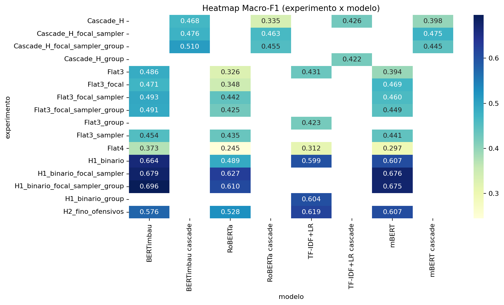
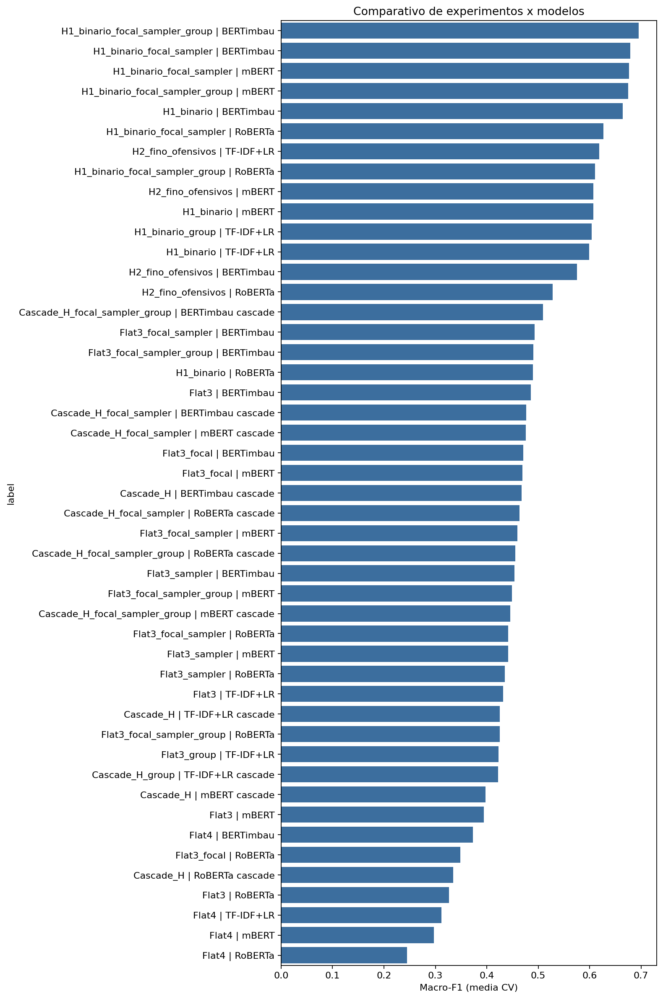
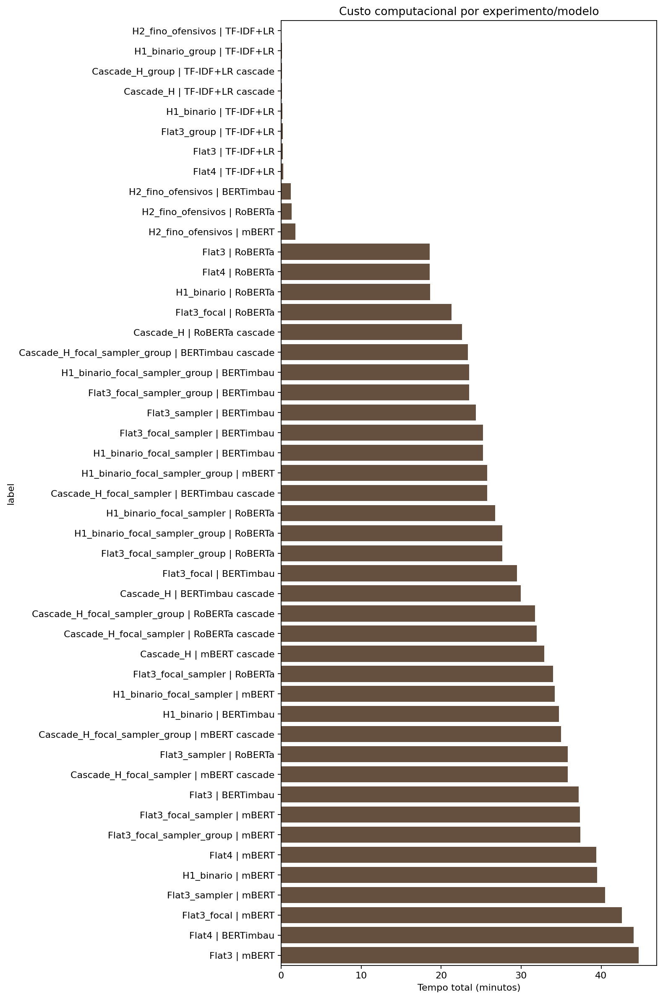
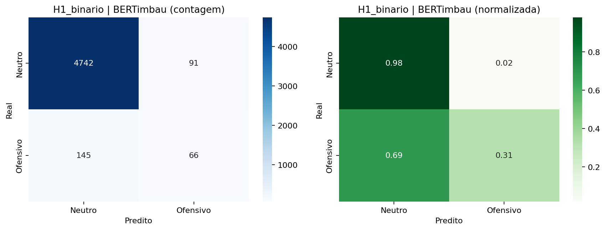
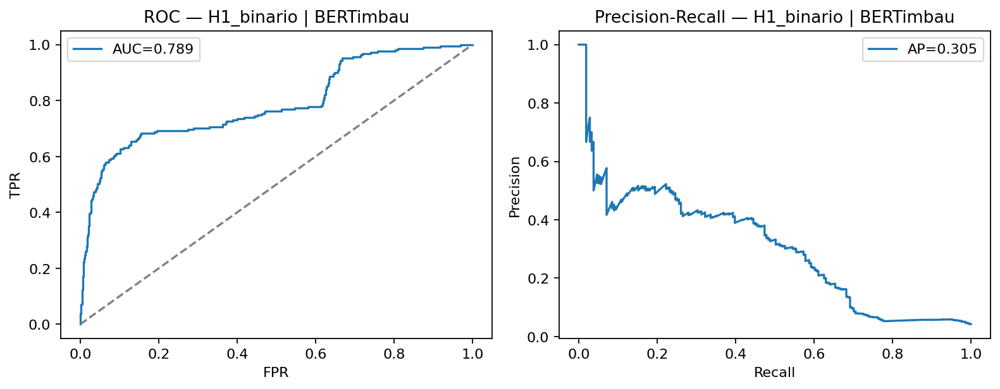
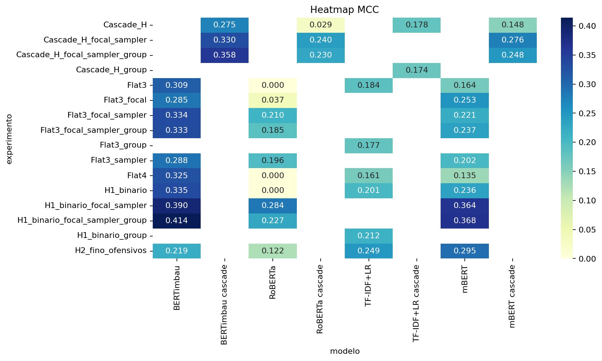

# Modeling & Evaluation

Technical specification of the **parliamentary offensive / hate-speech classifier** that this MCP server is designed to serve. The runtime default is the fine-tuned Hub checkpoint [`alissonf216/parliamentary-bertimbau-auditor`](https://huggingface.co/alissonf216/parliamentary-bertimbau-auditor). Override anytime via `PARLIAMENTARY_NLP_MODEL_ID` or `ParliamentaryModel(model_id=...)` — **no retraining is required inside the MCP package**.

This document covers: problem framing, corpus, label taxonomy, task formulations, training protocol, metrics, key results, figures, error modes, and how they map to the MCP tool contract.

### Companion artifacts (reproducibility)

| Path | Contents |
| --- | --- |
| [`../notebooks/`](../notebooks/) | Colab notebook + full experimental pipeline (`experimentos_pipeline.py`) |
| [`results/`](results/) | CSV / JSON tables from the completed suite |
| [`figures/`](figures/) | Heatmaps, bar charts, confusion matrices, ROC/PR curves |

Primary machine-readable table: [`results/resultados_experimentos_hierarquia_desbalanceamento.csv`](results/resultados_experimentos_hierarquia_desbalanceamento.csv) · run metadata: [`results/meta_execucao.json`](results/meta_execucao.json) (~18.5 h total GPU wall time on CUDA).

---

## 1. Problem framing

**Goal.** Detect offensive language and hate speech in **Brazilian Portuguese parliamentary discourse** (Chamber of Deputies floor speeches), at **sentence granularity**.

**Why it is hard.**

| Challenge | Implication |
| --- | --- |
| Formal institutional register | Models trained on social media transfer poorly |
| Extreme class imbalance | Neutral speech dominates; rare classes drive decision risk |
| Pragmatic ambiguity | Denunciation, quotation, and policy debate can look “toxic” lexically |
| Fine semantic boundaries | Generic insult ≠ attack on protected groups ≠ explicit hate |

The system is positioned as an **auditor with human-in-the-loop escalation**, not as an autonomous moderator. The MCP response field `requires_human_review` (Shannon entropy > 0.60) operationalizes that stance at inference time.

---

## 2. Corpus

| Attribute | Value |
| --- | --- |
| Source | Open Data API — Câmara dos Deputados (official speeches) |
| Window | Dec 2023 – May 2024 |
| Speeches | 254 |
| Speakers | 181 federal deputies |
| Units | **5,044 sentences** (mean length ≈ 28.3 words; range 9–87) |
| Annotation | Manual, domain-aware guidelines adapted from PT-BR hate/offense literature |

**Unit of analysis:** sentence. Offensive phenomena often concentrate in short spans; labeling whole speeches dilutes the signal.

**Known limitation:** single-annotator labeling (no inter-annotator agreement statistic yet). Downstream metrics should be read with that constraint in mind.

### Class distribution (after cleaning)

| Class id | Operational meaning | Count | % |
| --- | --- | --- | --- |
| 0 | Neutral / non-offensive | 4,833 | 95.82 |
| 1 | Potentially offensive, **not** aimed at protected groups | 100 | 1.98 |
| 2 | Offensive toward protected groups, **without** explicit incitement | 7 | 0.14 |
| 3 | Explicit hate speech (incitement to violence, hate, or discrimination) | 104 | 2.06 |

Class 2 is extremely scarce — the main bottleneck for a full 4-way flat classifier.

---

## 3. Label taxonomy (maps 1:1 to MCP schema)

| Research class | MCP / production label | Description |
| --- | --- | --- |
| 0 | `NEUTRAL` | Non-offensive parliamentary utterance |
| 1 | `GENERIC_OFFENSE` | Insult / hostility without protected-group targeting |
| 2 | `TARGETED_OFFENSE` | Offense directed at protected groups (no explicit incitement) |
| 3 | `EXPLICIT_HATE_SPEECH` | Explicit hate / discrimination / violence incitement |

These strings are the canonical keys expected in `classification` and `class_probabilities` once the production 4-class checkpoint is loaded.

---

## 4. Task formulations

Because Flat-4 is fragile under the imbalance above, the experimental design treats **task structure** as a first-class variable:

| Formulation | Definition |
| --- | --- |
| **H1 (binary)** | Neutral vs. any offensive (merge 1∪2∪3) |
| **H2 (fine)** | Among offensive sentences: generic offense vs. protected-group attack (2∪3 merged) |
| **Flat-3** | Neutral / generic offense / protected-group attack |
| **Flat-4** | Full 4-class taxonomy |
| **Cascade** | Run H1; if offensive, run H2; map output to Flat-3 |

**Practical recommendation for deployment:** prefer **H1** for screening and **cascade / Flat-3** when a graded label is required. Flat-4 remains the research target for the production head, with uncertainty flagging for borderline cases.

---

## 5. Models compared

| Model | Role |
| --- | --- |
| TF-IDF + Logistic Regression | Lexical baseline |
| mBERT | Multilingual Transformer transfer |
| RoBERTa-base | Strong English-centric pretraining baseline |
| **BERTimbau-base** | Primary PT-BR backbone (preferred production family) |

Tokenization / heads: `BertTokenizer` + `BertForSequenceClassification` (mBERT, BERTimbau); `RobertaTokenizer` + `RobertaForSequenceClassification` (RoBERTa). Input truncated at **128 tokens** during training experiments.

> **Repo runtime note.** Serving uses [`alissonf216/parliamentary-bertimbau-auditor`](https://huggingface.co/alissonf216/parliamentary-bertimbau-auditor) via `AutoModelForSequenceClassification` / `AutoTokenizer`.

---

## 6. Training & evaluation protocol

### Imbalance strategies

- **Class weighting** on cross-entropy (baseline)
- **Focal Loss** (γ = 2)
- **WeightedRandomSampler** (oversample minorities in minibatches)
- Combinations of the above
- Natural class distribution **preserved on the test folds** (no synthetic undersampling of neutrals at evaluation)

### Validation

- Stratified **5-fold** cross-validation
- Additional control: `StratifiedGroupKFold` by `id_deputado` (speaker-level leakage control)
- Per fold: ~80% train / 20% test; 10% of train held out for validation + early stopping

### Hyperparameters (Transformers)

| Setting | Value |
| --- | --- |
| Optimizer | AdamW |
| Learning rate | 2×10⁻⁵ |
| Batch size | 8 |
| Scheduler | Warmup + decay |
| Early stopping | Macro-F1 on validation |
| Max epochs / fold | 12 |
| Seed | 42 |
| Hardware (study) | NVIDIA Tesla T4 (Colab-class) |

### Metrics

| Metric | Role |
| --- | --- |
| **Macro-F1** | Primary selection criterion (equal weight to rare classes) |
| Weighted-F1 | Frequency-aware complement |
| MCC | Correlation under imbalance |
| ROC-AUC / AP | Binary (H1) only |
| Confusion matrices + qualitative error audit | Failure-mode analysis |

---

## 7. Key results (summary)

Best configurations by formulation (Macro-F1 ± std over folds):

| Task | Best setup | Model | Macro-F1 | MCC | CV wall time |
| --- | --- | --- | --- | --- | --- |
| **H1** | Focal + sampler + group split | BERTimbau | **0.696 ± 0.026** | 0.414 | ~23.5 min |
| **H2** | Baseline | TF-IDF+LR | **0.619 ± 0.019** | 0.249 | ~0.2 s |
| **Flat-3** | Focal + sampler | BERTimbau | **0.493 ± 0.022** | 0.334 | ~25.2 min |
| **Flat-4** | Class weighting | BERTimbau | **0.373 ± 0.030** | 0.325 | ~44.0 min |
| **Cascade → Flat-3** | Focal + sampler + group | BERTimbau | **0.510 ± 0.019** | 0.358 | ~23.3 min |

**H1 detail (BERTimbau, best row):** F1(positive) ≈ 0.423 · ROC-AUC ≈ 0.909.

### Takeaways

1. **BERTimbau** leads the strongest neural setups (language match matters).
2. **Flat-4 is limited** by class-2 scarcity; Flat-3 and cascade raise the multiclass ceiling.
3. **Focal Loss + weighted sampling** reduce collapse to the neutral majority without distorting the test prior.
4. **H2 remains brittle** — lexical baseline can compete when offensive subsets are tiny.
5. Aggregate scores alone are insufficient; qualitative errors dominate risk in institutional use.

---

## 8. Figures from the experimental suite

Selected plots committed under [`figures/`](figures/). Browse the full set (per-model confusion matrices, PRF1 bars, ROC/PR) in that folder.

### Macro-F1 heatmap (experiment × model)



### Macro-F1 comparison (bars)



### Runtime cost (bars)



### H1 — BERTimbau confusion matrix



### H1 — BERTimbau ROC / Precision-Recall



### MCC heatmap



---

## 9. Qualitative error modes

Recurring failure clusters observed in audits:

1. **Ambiguity** — sensitive terms without clear offensive intent  
2. **Indirect reference** — hostility via institutions, offices, or events  
3. **Missing discourse context** — sentence-only classification loses turn-level cues  
4. **Irony / sarcasm** — polarity inversion  
5. **Super-detection** — legitimate denunciation / condemnation labeled as offense  
6. **Sub-detection** — veiled hostility missed in H1 false negatives  

These motivate the MCP design choice: return full probability vectors + entropy, and flag `requires_human_review` when the predictive distribution is diffuse.

---

## 10. Mapping research → this MCP repository

| Research artifact | Repository counterpart |
| --- | --- |
| Experimental notebook + pipeline | [`notebooks/`](../notebooks/) |
| Result tables | [`results/`](results/) |
| Evaluation plots | [`figures/`](figures/) |
| 4-class taxonomy | `LABELS` in `src/parliamentary_nlp/model.py` |
| Softmax probabilities | `class_probabilities` |
| Top-class decision | `classification`, `confidence` |
| Decision uncertainty | `entropy_uncertainty` (Shannon entropy) |
| Human escalation | `requires_human_review` if entropy > 0.60 |
| Production BERTimbau head | Default Hub id `alissonf216/parliamentary-bertimbau-auditor` (or override via env) |

```bash
parliamentary-nlp-mcp

# Optional override
export PARLIAMENTARY_NLP_MODEL_ID="alissonf216/parliamentary-bertimbau-auditor"
parliamentary-nlp-mcp
```

Unit tests in `tests/test_model.py` validate the **output contract** with mocked logits (no GPU / no download), so CI stays green while weights evolve.

---

## 11. Deployment guidance (for integrators)

1. Use the MCP tool for **sentence- or short-excerpt** audits aligned with training granularity.  
2. Treat high-entropy or mid-confidence offensive flags as **review queue** items.  
3. Prefer screening with a binary-capable head if operational cost of false positives is high; use graded labels when analysts need taxonomy.  
4. Re-audit periodically by protected-attribute subgroups before any institutional rollout.  
5. Keep the production model id in environment / secrets — do not hardcode credentials or private paths in clients.

---

## 12. Roadmap (modeling side)

- Expand corpus and multi-annotator agreement (Cohen’s κ)  
- Strengthen class-2 coverage or hierarchical decoding in production  
- Fairness / subgroup error reporting  
- Optional longer context windows beyond single-sentence inference  
- Iterate on the Hub checkpoint `alissonf216/parliamentary-bertimbau-auditor` (data, agreement, fairness)

---

*This specification describes the modeling and evaluation protocol behind the auditor. The MCP package is the serving layer: stable JSON tool I/O today, production weights when ready.*
